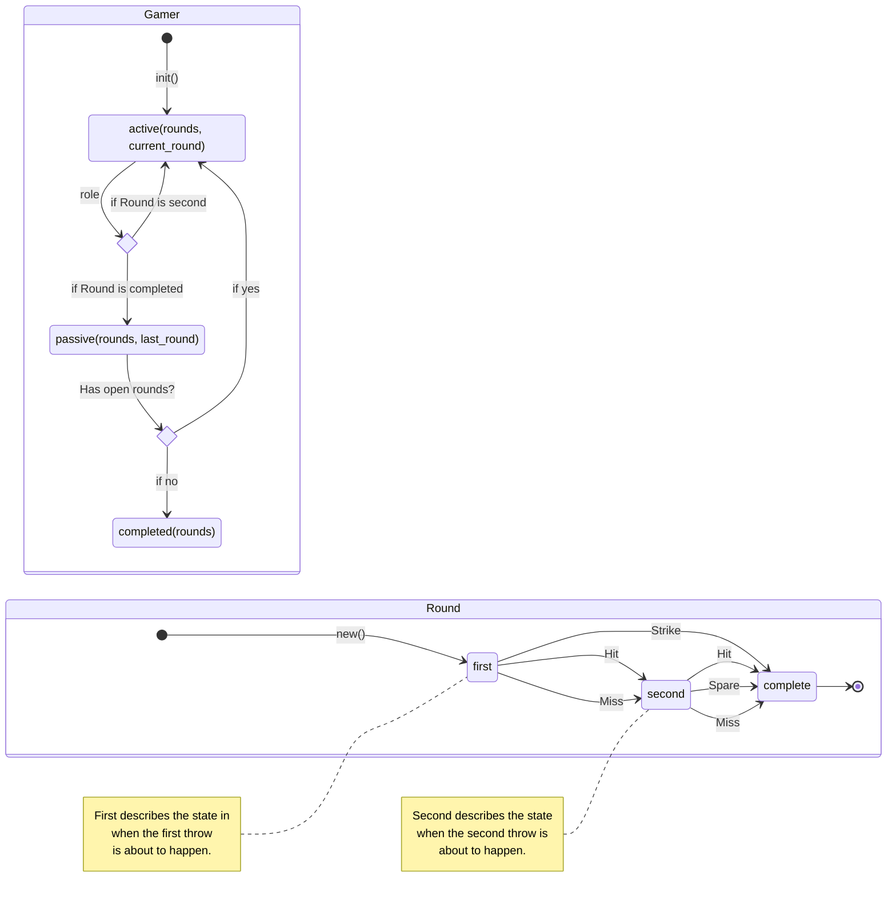

## Bowling

### What is this Repo all about?

This repo is all about playing around with Rust by builing a little bowling Game in rust.
The idea is to build a crate that can be used to calculate the points of a bowling game with one or multiple player.

The main purpose of this is to get familiar with rust and to see how a synchronise CLI game may look like.

### State machine

### Vision

The vison is to have a CLI game that makes it possible that multiple player bowl sequentiually while the crate returns a displable score and game table.
