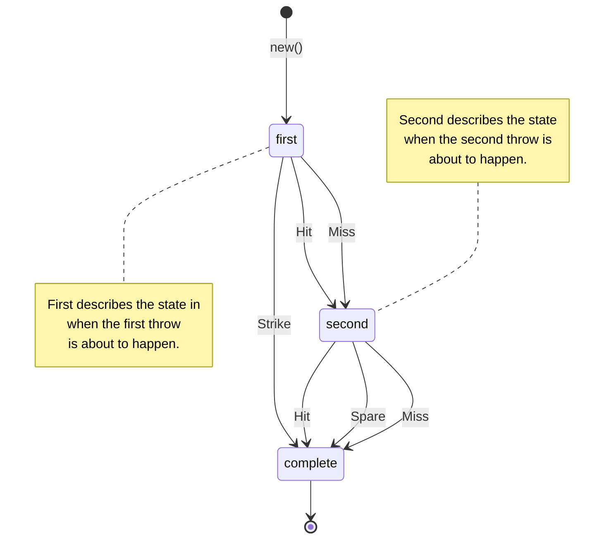

```mermaid
stateDiagram-v2
  %% States
  first
  second
  complete

  %% Transactions
  [*] --> first: new()
  first --> second: Hit
  first --> second: Miss
  first --> complete: Strike
  second --> complete: Hit
  second --> complete: Spare
  second --> complete: Miss
  complete --> [*]

  %% Notes
  note right of first
    First describes the state in
    when the first throw
    is about to happen.
  end note

  note left of second
    Second describes the state
    when the second throw is
    about to happen.
  end note
```
